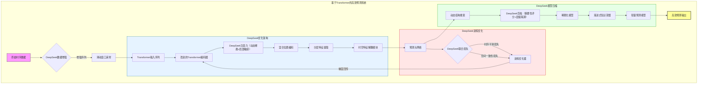

```mermaid
graph TD

subgraph 基于Transformer的高效预测系统
    A[原始时序数据] --> B{DeepSeek数据增强}
    B -->|增强序列| C[滑动窗口采样]
    C --> D[Transformer输入序列]

    subgraph DeepSeek优化架构
        D --> E[改进的Transformer编码器]
        E --> F["DeepSeek注意力（动态稀疏+局部敏感）"]
        F --> G[混合位置编码]
        G --> H[分层特征提取]
        H --> I[时空特征解耦模块]
    end

    subgraph DeepSeek训练优化
        I --> J[预测头网络]
        J --> K{DeepSeek联合损失}
        K -->|时序平滑损失| L[训练优化器]
        K -->|空间一致性损失| L
        L -->|梯度回传| E
    end

    subgraph DeepSeek模型压缩
        J --> M[动态结构搜索]
        M --> N["DeepSeek剪枝（重要性评分+层级联调）"]
        N --> O[稀疏化模型]
        O --> P[渐进式知识蒸馏]
        P --> Q[轻量预测模型]
    end

    Q --> R[高效预测输出]
end

style A fill:#f9f,stroke:#333
style R fill:#ff9,stroke:#333,stroke-width:2px
classDef deepseek fill:#e6f3ff,stroke:#069;
classDef train fill:#ffe6e6,stroke:#c00;
classDef compress fill:#e6ffe6,stroke:#090;
class DeepSeek优化架构 deepseek
class DeepSeek训练优化 train
class DeepSeek模型压缩 compress
```