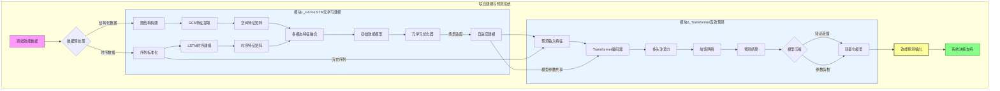

```mermaid
graph TD

subgraph 联合建模与预测系统
    A[原始效能数据] --> B{数据预处理}
    B -->|结构化数据| C[图结构构建]
    B -->|时序数据| D[序列标准化]
    
    subgraph 模块1_GCN-LSTM元学习建模
        C --> E[GCN特征提取]
        D --> F[LSTM时序建模]
        E --> G[空间特征矩阵]
        F --> H[时序特征矩阵]
        G & H --> I[多模态特征融合]
        I --> J[初始效能模型]
        J --> K[元学习优化器]
        K -->|场景适配| L[自适应建模]
    end
    
    subgraph 模块2_Transformer高效预测
        L --> M[预测输入特征]
        D -->|历史序列| M
        M --> N[Transformer编码器]
        N --> O[多头注意力]
        O --> P[前馈网络]
        P --> Q[预测结果]
        Q --> R{模型压缩}
        R -->|知识蒸馏| S[轻量化模型]
        R -->|参数剪枝| S
    end
    
    L -->|模型参数共享| N
    S --> T[效能预测输出]
    T --> U[系统决策支持]
end

style A fill:#f9f,stroke:#333
style T fill:#ff9,stroke:#333,stroke-width:2px
style U fill:#8f8,stroke:#060
classDef module fill:#e8f4ff,stroke:#339,stroke-width:1px;
class 模块1_GCN-LSTM元学习建模,模块2_Transformer高效预测 module
```