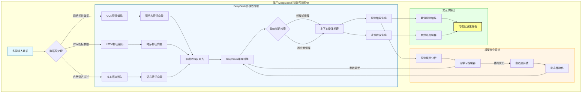

```mermaid
graph TD

subgraph 基于DeepSeek的智能预测系统
    A[多源输入数据] --> B{数据预处理}
    B -->|网络拓扑数据| C[GCN特征编码]
    B -->|时序指标数据| D[LSTM特征编码]
    B -->|自然语言描述| E[文本语义嵌入]

    subgraph DeepSeek多模态推理
        C --> F[图结构特征向量]
        D --> G[时序特征向量]
        E --> H[语义特征向量]
        F & G & H --> I[多模态特征对齐]
        I --> J[DeepSeek推理引擎]
        J --> K{动态知识检索}
        K -->|领域知识库| L[上下文增强推理]
        K -->|历史案例库| L
        L --> M[预测结果生成]
        L --> N[决策建议生成]
    end

    subgraph 模型优化系统
        M --> O[预测误差分析]
        O --> P[元学习控制器]
        P -->|参数调优| J
        P -->|结构优化| Q[自适应剪枝]
        Q --> R[动态稀疏化]
        R --> J
    end

    subgraph 交互式输出
        M --> S[数值预测结果]
        N --> T[自然语言解释]
        S & T --> U[可视化决策报告]
    end
end

style A fill:#e6f9ff,stroke:#069
style U fill:#ff9,stroke:#333,stroke-width:2px
classDef llm fill:#f0f8ff,stroke:#069,stroke-width:1.5px;
classDef optimize fill:#fff5e6,stroke:#f90;
classDef output fill:#e6ffe6,stroke:#090;
class DeepSeek多模态推理 llm
class 模型优化系统 optimize
class 交互式输出 output
```