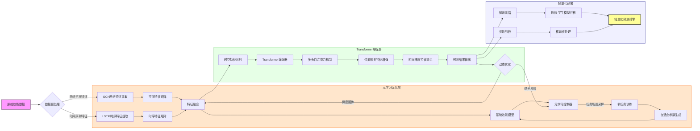

```mermaid
graph LR

A[原始效能数据] --> B{数据预处理}
B -->|网络拓扑特征| C[GCN网络特征提取]
B -->|时间序列特征| D[LSTM时序特征提取]

subgraph 元学习优化层
    C --> E[空间特征矩阵]
    D --> F[时序特征矩阵]
    E & F --> G[交叉注意力融合]
    G --> H[基础效能模型]
    H --> I[元学习控制器]
    I -->|任务场景采样| J[多任务训练]
    J --> K[自适应参数生成]
    K --> H
end

subgraph Transformer增强层
    G --> L[时空特征序列]
    L --> M[Transformer编码器]
    M --> N[多头自注意力机制]
    N --> O[位置相关特征增强]
    O --> P[时间维度特征重组]
    P --> Q[预测结果输出]
    
    Q --> R{动态优化}
    R -->|误差反馈| I[元学习控制器]
    R -->|梯度回传| G[特征融合]
end

subgraph 轻量化部署
    Q --> S[知识蒸馏]
    S --> T[教师-学生模型迁移]
    Q --> U[参数剪枝]
    U --> V[稀疏化处理]
    T & V --> W[轻量化预测引擎]
end

style A fill:#f9f,stroke:#333
style W fill:#ff9,stroke:#333,stroke-width:2px
classDef meta fill:#ffe6cc,stroke:#f60;
classDef trans fill:#e6ffe6,stroke:#090;
classDef light fill:#f0f0ff,stroke:#339;
class 元学习优化层 meta
class Transformer增强层 trans
class 轻量化部署 light

```