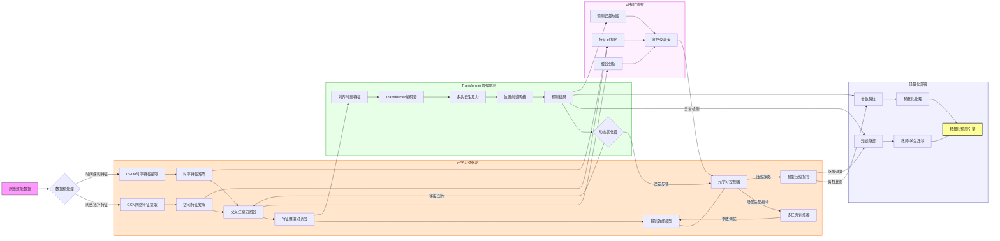

```mermaid
graph LR

A[原始效能数据] --> B{数据预处理}
B -->|网络拓扑特征| C[GCN网络特征提取]
B -->|时间序列特征| D[LSTM时序特征提取]

subgraph 元学习优化层
    C --> E[空间特征矩阵]
    D --> F[时序特征矩阵]
    E & F --> G[交叉注意力融合]
    G --> H[特征维度对齐层]
    H --> I[基础效能模型]
    I --> J[元学习控制器]
    J -->|场景适配指令| K[多任务训练器]
    K -->|参数调优| I
    J -->|压缩策略| M[模型压缩指导]
end

subgraph Transformer增强预测
    H --> L[对齐时空特征]
    L --> N[Transformer编码器]
    N --> O[多头自注意力]
    O --> P[位置前馈网络]
    P --> Q[预测结果]
    
    Q --> R{动态优化器}
    R -->|误差反馈| J
    R -->|梯度回传| G
end

subgraph 轻量化部署
    Q --> S[知识蒸馏]
    S --> T[教师-学生迁移]
    Q --> U[参数剪枝]
    U --> V[稀疏化处理]
    T & V --> W[轻量化预测引擎]
    M -->|剪枝比例| U
    M -->|蒸馏温度| S
end

subgraph 可视化监控
    E --> X[特征可视化]
    F --> X
    G --> Y[融合分析]
    Q --> Z[预测误差热图]
    X & Y & Z --> AA[监控仪表盘]
    AA -->|异常检测| J
end

style A fill:#f9f,stroke:#333
style W fill:#ff9,stroke:#333,stroke-width:2px
classDef meta fill:#ffe6cc,stroke:#f60;
classDef trans fill:#e6ffe6,stroke:#090;
classDef light fill:#f0f0ff,stroke:#339;
classDef monitor fill:#fff0ff,stroke:#c0c;
class 元学习优化层 meta
class Transformer增强预测 trans
class 轻量化部署 light
class 可视化监控 monitor
```