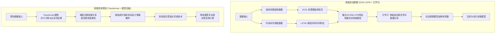

```mermaid
flowchart TD
    %% 基于GCN-LSTM与元学习的效能自动建模
    subgraph "效能自动建模 (GCN-LSTM + 元学习)"
        A1[数据输入]
        A2[指标间图结构数据]
        A3[时间序列效能数据]
        A4[GCN: 处理图结构信息]
        A5[LSTM: 捕捉时间序列特征]
        A6[融合GCN与LSTM特征<br>构建初步效能模型]
        A7[元学习: 快速适应新任务与数据分布]
        A8[自动调整模型结构和参数]
        A9[生成与优化效能模型]
        
        A1 --> A2
        A1 --> A3
        A2 --> A4
        A3 --> A5
        A4 --> A6
        A5 --> A6
        A6 --> A7
        A7 --> A8
        A8 --> A9
    end

    %% 基于Transformer的效能高效预测
    subgraph "效能高效预测 (Transformer + 模型压缩)"
        B1[预测数据输入]
        B2[Transformer模型:<br>并行计算与长序列处理]
        B3[捕捉长期依赖关系<br>提高预测准确性]
        B4[面临超大指标体系及计算量爆炸]
        B5[采用知识蒸馏与剪枝技术]
        B6[降低模型复杂度<br>实现高效计算]
        
        B1 --> B2
        B2 --> B3
        B3 --> B4
        B4 --> B5
        B5 --> B6
    end

```