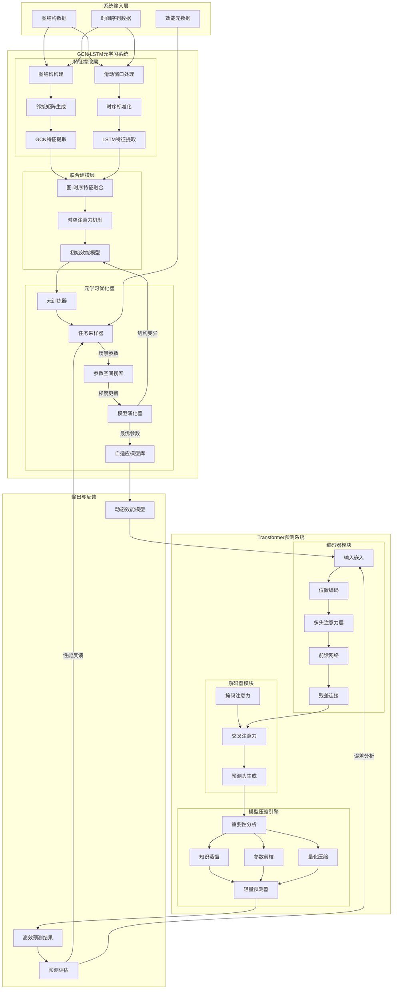

```mermaid
graph TD
    subgraph 系统输入层
        IN1[图结构数据]
        IN2[时间序列数据]
        IN3[效能元数据]
    end

    subgraph GCN-LSTM元学习系统
        subgraph 特征提取层
            G1[图结构构建] --> G2[邻接矩阵生成]
            G2 --> G3[GCN特征提取]
            T1[滑动窗口处理] --> T2[时序标准化]
            T2 --> T3[LSTM特征提取]
        end

        subgraph 联合建模层
            G3 --> M1[图-时序特征融合]
            T3 --> M1
            M1 --> M2[时空注意力机制]
            M2 --> M3[初始效能模型]
        end

        subgraph 元学习优化器
            M3 --> OL1[元训练器]
            OL1 --> OL2[任务采样器]
            OL2 -->|场景参数| OL3[参数空间搜索]
            OL3 -->|梯度更新| OL4[模型演化器]
            OL4 -->|结构变异| M3
            OL4 -->|最优参数| OS1[自适应模型库]
        end
    end

    subgraph Transformer预测系统
        subgraph 编码器模块
            TR1[输入嵌入] --> TR2[位置编码]
            TR2 --> TR3[多头注意力层]
            TR3 --> TR4[前馈网络]
            TR4 --> TR5[残差连接]
        end

        subgraph 解码器模块
            DC1[掩码注意力] --> DC2[交叉注意力]
            DC2 --> DC3[预测头生成]
        end

        subgraph 模型压缩引擎
            DC3 --> CP1[重要性分析]
            CP1 --> CP2[知识蒸馏]
            CP1 --> CP3[参数剪枝]
            CP1 --> CP4[量化压缩]
            CP2 & CP3 & CP4 --> CP5[轻量预测器]
        end
    end

    subgraph 输出与反馈
        OS1 --> OUT1[动态效能模型]
        CP5 --> OUT2[高效预测结果]
        OUT2 --> FB1[预测评估]
        FB1 -->|性能反馈| OL2
        FB1 -->|误差分析| TR1
    end

    IN1 & IN2 --> G1 & T1
    IN3 --> OL2
    TR5 --> DC2
    OUT1 --> TR1
```